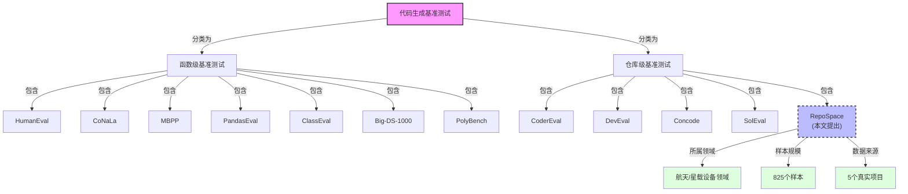

```mermaid
graph TD
    %% 核心节点定义
    Root["代码生成基准测试"]
    FuncLevel["函数级基准测试"]
    RepoLevel["仓库级基准测试"]
    
    %% RepoSpace 特有节点
    RepoSpace["RepoSpace<br/>(本文提出)"]
    SpaceDomain["航天/星载设备领域"]
    SampleCount["825个样本"]
    ProjectSource["5个真实项目"]
    
    %% 现有函数级数据集节点
    HE["HumanEval"]
    CN["CoNaLa"]
    MB["MBPP"]
    PE["PandasEval"]
    CE["ClassEval"]
    BD["Big-DS-1000"]
    PB["PolyBench"]
    
    %% 现有仓库级数据集节点
    CodE["CoderEval"]
    DevE["DevEval"]
    Conc["Concode"]
    SolE["SolEval"]

    %% 三元组关系构建 (实体 -> 关系 -> 实体)
    
    %% 第一层级分类
    Root -->|分类为| FuncLevel
    Root -->|分类为| RepoLevel
    
    %% 函数级基准测试包含的数据集
    FuncLevel -->|包含| HE
    FuncLevel -->|包含| CN
    FuncLevel -->|包含| MB
    FuncLevel -->|包含| PE
    FuncLevel -->|包含| CE
    FuncLevel -->|包含| BD
    FuncLevel -->|包含| PB
    
    %% 仓库级基准测试包含的数据集
    RepoLevel -->|包含| CodE
    RepoLevel -->|包含| DevE
    RepoLevel -->|包含| Conc
    RepoLevel -->|包含| SolE
    
    %% 本文提出的 RepoSpace 及其属性
    RepoLevel -->|包含| RepoSpace
    RepoSpace -->|所属领域| SpaceDomain
    RepoSpace -->|样本规模| SampleCount
    RepoSpace -->|数据来源| ProjectSource

    %% 样式调整
    style Root fill:#f9f,stroke:#333,stroke-width:2px
    style RepoSpace fill:#bbf,stroke:#333,stroke-width:2px,stroke-dasharray: 5 5
    style SpaceDomain fill:#dfd
    style SampleCount fill:#dfd
    style ProjectSource fill:#dfd
```
