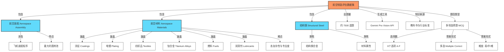

```mermaid
graph TD
    %% 定义节点样式
    classDef root fill:#f96,stroke:#333,stroke-width:2px;
    classDef category fill:#61dafb,stroke:#333,stroke-width:2px;
    classDef item fill:#fff,stroke:#333,stroke-width:1px;

    %% 根节点
    Root[航空制造评估数据集]:::root

    %% 一级分类 (三元组: 数据集 -- 包含 --> 分类)
    Root -- 包含 --> Assembly[航空装配 Aerospace Assembly]:::category
    Root -- 包含 --> Materials[航空材料 Aerospace Materials]:::category
    Root -- 包含 --> Steel[结构钢 Structural Steel]:::category

    %% 属性与元数据 (三元组: 数据集 -- 属性 --> 值)
    Root -- 总题量 --> Count[约 7500 道题]:::item
    Root -- 生成工具 --> Tool[Gemini Pro Vision API]:::item
    Root -- 知识来源 --> Source[教科书与行业标准]:::item
    Root -- 题目类型 --> Type[多项选择题 MCQ]:::item

    %% 航空装配的细节 (三元组: 航空装配 -- 涉及 --> 内容)
    Assembly -- 涉及 --> A_Proc[飞机装配程序]:::item
    Assembly -- 特点 --> A_Vol[最大的题库池]:::item

    %% 航空材料的细分 (三元组: 航空材料 -- 涵盖 --> 子领域)
    Materials -- 涵盖 --> M_Coat[涂层 Coatings]:::item
    Materials -- 涵盖 --> M_Plat[电镀 Plating]:::item
    Materials -- 涵盖 --> M_Tex[纺织品 Textiles]:::item
    Materials -- 涵盖 --> M_Ti[钛合金 Titanium Alloys]:::item
    Materials -- 涵盖 --> M_Fuel[燃料 Fuels]:::item
    Materials -- 涵盖 --> M_Lub[润滑剂 Lubricants]:::item
    Materials -- 难点 --> M_Diff[高复杂性与专业度]:::item

    %% 结构钢的细节 (三元组: 结构钢 -- 聚焦 --> 内容)
    Steel -- 聚焦 --> S_Alloy[结构钢合金]:::item
    Steel -- 聚焦 --> S_Prop[材料属性]:::item

    %% 题目属性细节 (三元组: 题目类型 -- 包含 --> 属性)
    Type -- 选项数 --> Opt[6个选项 A-F]:::item
    Type -- 答案形式 --> Ans[多选 Multiple Correct]:::item
    Type -- 答案形式 --> Diff[难度: 易/中/难]:::item
```
