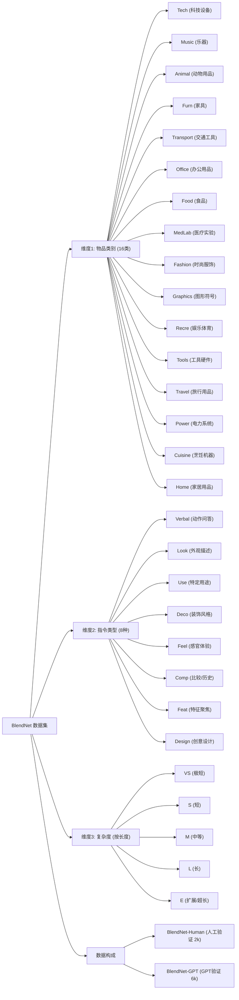

```mermaid
graph LR
    %% 根节点
    Dataset["BlendNet 数据集"]

    %% 维度1：物品类别
    Dim_Category["维度1: 物品类别 (16类)"]
    Dataset --> Dim_Category
    
    Dim_Category --> Cat01["Tech (科技设备)"]
    Dim_Category --> Cat02["Music (乐器)"]
    Dim_Category --> Cat03["Animal (动物用品)"]
    Dim_Category --> Cat04["Furn (家具)"]
    Dim_Category --> Cat05["Transport (交通工具)"]
    Dim_Category --> Cat06["Office (办公用品)"]
    Dim_Category --> Cat07["Food (食品)"]
    Dim_Category --> Cat08["MedLab (医疗实验)"]
    Dim_Category --> Cat09["Fashion (时尚服饰)"]
    Dim_Category --> Cat10["Graphics (图形符号)"]
    Dim_Category --> Cat11["Recre (娱乐体育)"]
    Dim_Category --> Cat12["Tools (工具硬件)"]
    Dim_Category --> Cat13["Travel (旅行用品)"]
    Dim_Category --> Cat14["Power (电力系统)"]
    Dim_Category --> Cat15["Cuisine (烹饪机器)"]
    Dim_Category --> Cat16["Home (家居用品)"]

    %% 维度2：指令类型
    Dim_Type["维度2: 指令类型 (8种)"]
    Dataset --> Dim_Type

    Dim_Type --> Type01["Verbal (动作问答)"]
    Dim_Type --> Type02["Look (外观描述)"]
    Dim_Type --> Type03["Use (特定用途)"]
    Dim_Type --> Type04["Deco (装饰风格)"]
    Dim_Type --> Type05["Feel (感官体验)"]
    Dim_Type --> Type06["Comp (比较/历史)"]
    Dim_Type --> Type07["Feat (特征聚焦)"]
    Dim_Type --> Type08["Design (创意设计)"]

    %% 维度3：复杂度
    Dim_Complexity["维度3: 复杂度 (按长度)"]
    Dataset --> Dim_Complexity

    Dim_Complexity --> Len01["VS (极短)"]
    Dim_Complexity --> Len02["S (短)"]
    Dim_Complexity --> Len03["M (中等)"]
    Dim_Complexity --> Len04["L (长)"]
    Dim_Complexity --> Len05["E (扩展/超长)"]

    %% 数据构成
    Dim_Comp["数据构成"]
    Dataset --> Dim_Comp

    Dim_Comp --> Part01["BlendNet-Human (人工验证 2k)"]
    Dim_Comp --> Part02["BlendNet-GPT (GPT验证 6k)"]
```
