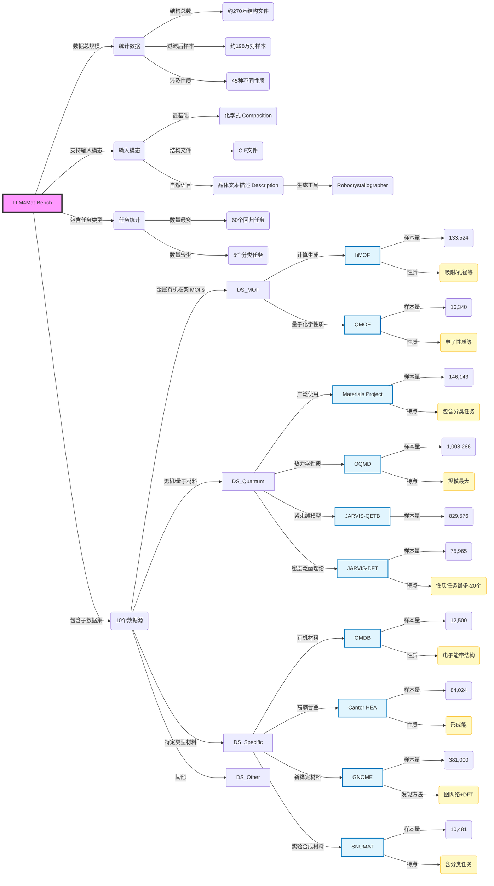

```mermaid
graph LR
    %% 核心节点
    Core[LLM4Mat-Bench]

    %% 第一层：主要组成部分
    Core -->|包含子数据集| DataSources(10个数据源)
    Core -->|支持输入模态| Modalities(输入模态)
    Core -->|包含任务类型| Tasks(任务统计)
    Core -->|数据总规模| TotalStats(统计数据)

    %% 统计数据分支
    TotalStats -->|结构总数| S1(约270万结构文件)
    TotalStats -->|过滤后样本| S2(约198万对样本)
    TotalStats -->|涉及性质| S3(45种不同性质)

    %% 输入模态分支
    Modalities -->|最基础| M1(化学式 Composition)
    Modalities -->|结构文件| M2(CIF文件)
    Modalities -->|自然语言| M3(晶体文本描述 Description)
    M3 -->|生成工具| M3_Tool(Robocrystallographer)

    %% 任务类型分支
    Tasks -->|数量最多| T1(60个回归任务)
    Tasks -->|数量较少| T2(5个分类任务)

    %% 数据源分支 - 详细分类
    DataSources -->|金属有机框架 MOFs| DS_MOF
    DataSources -->|无机/量子材料| DS_Quantum
    DataSources -->|特定类型材料| DS_Specific
    DataSources -->|其他| DS_Other

    %% MOF类
    DS_MOF -->|计算生成| hMOF[hMOF]
    hMOF -->|样本量| hMOF_N(133,524)
    hMOF -->|性质| hMOF_P(吸附/孔径等)

    DS_MOF -->|量子化学性质| QMOF[QMOF]
    QMOF -->|样本量| QMOF_N(16,340)
    QMOF -->|性质| QMOF_P(电子性质等)

    %% 无机/量子材料类
    DS_Quantum -->|广泛使用| MP[Materials Project]
    MP -->|样本量| MP_N(146,143)
    MP -->|特点| MP_F(包含分类任务)

    DS_Quantum -->|热力学性质| OQMD[OQMD]
    OQMD -->|样本量| OQMD_N(1,008,266)
    OQMD -->|特点| OQMD_F(规模最大)

    DS_Quantum -->|紧束缚模型| JARVIS_Q[JARVIS-QETB]
    JARVIS_Q -->|样本量| JQ_N(829,576)

    DS_Quantum -->|密度泛函理论| JARVIS_D[JARVIS-DFT]
    JARVIS_D -->|样本量| JD_N(75,965)
    JARVIS_D -->|特点| JD_F(性质任务最多-20个)

    %% 特定类型材料
    DS_Specific -->|有机材料| OMDB[OMDB]
    OMDB -->|样本量| OMDB_N(12,500)
    OMDB -->|性质| OMDB_P(电子能带结构)

    DS_Specific -->|高熵合金| Cantor[Cantor HEA]
    Cantor -->|样本量| Cantor_N(84,024)
    Cantor -->|性质| Cantor_P(形成能)

    DS_Specific -->|新稳定材料| GNOME[GNOME]
    GNOME -->|样本量| GNOME_N(381,000)
    GNOME -->|发现方法| GNOME_M(图网络+DFT)

    DS_Specific -->|实验合成材料| SNUMAT[SNUMAT]
    SNUMAT -->|样本量| SNUMAT_N(10,481)
    SNUMAT -->|特点| SNUMAT_F(含分类任务)

    %% 样式定义
    classDef core fill:#f9f,stroke:#333,stroke-width:4px;
    classDef dataset fill:#e1f5fe,stroke:#0277bd,stroke-width:2px;
    classDef property fill:#fff9c4,stroke:#fbc02d,stroke-width:1px;
    
    class Core core;
    class hMOF,QMOF,MP,OQMD,JARVIS_Q,JARVIS_D,OMDB,Cantor,GNOME,SNUMAT dataset;
    class hMOF_P,QMOF_P,MP_F,OQMD_F,JD_F,OMDB_P,Cantor_P,GNOME_M,SNUMAT_F property;
```
