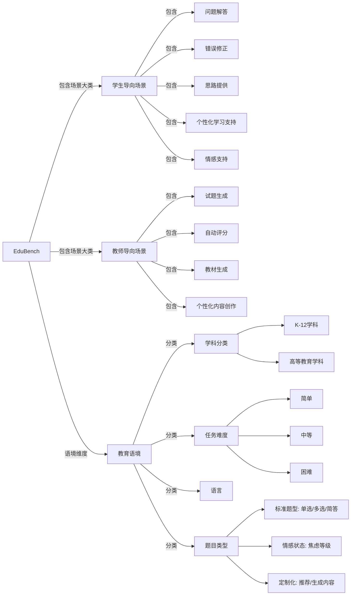

# EduBench 知识图谱

下面是基于论文《EduBench: A Comprehensive Benchmarking Dataset》构建的分类图谱：

```mermaid
graph LR
    Root[EduBench] -->|包含场景大类| Student[学生导向场景]
    Root -->|包含场景大类| Teacher[教师导向场景]
    Root -->|语境维度| Context[教育语境]

    Student -->|包含| S1[问题解答]
    Student -->|包含| S2[错误修正]
    Student -->|包含| S3[思路提供]
    Student -->|包含| S4[个性化学习支持]
    Student -->|包含| S5[情感支持]

    Teacher -->|包含| T1[试题生成]
    Teacher -->|包含| T2[自动评分]
    Teacher -->|包含| T3[教材生成]
    Teacher -->|包含| T4[个性化内容创作]

    Context -->|分类| Subject[学科分类]
    Context -->|分类| Diff[任务难度]
    Context -->|分类| Lang[语言]
    Context -->|分类| QType[题目类型]

    Subject --> K12[K-12学科]
    Subject --> HigherEd[高等教育学科]
    
    Diff --> D1[简单]
    Diff --> D2[中等]
    Diff --> D3[困难]

    QType --> QT1[标准题型: 单选/多选/简答]
    QType --> QT2[情感状态: 焦虑等级]
    QType --> QT3[定制化: 推荐/生成内容]
```
